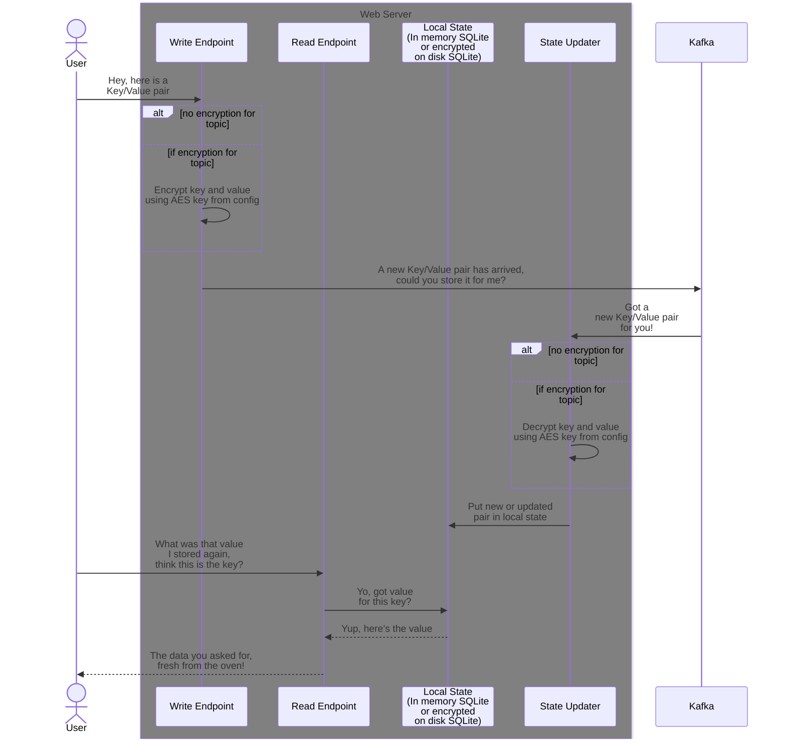

# About

A demo of a simple distributed service that allows you to store and retrieve key-value pairs using a web/REST/http API.

## What does it do

It sets up a dotnet web server, that takes data you want to store.
Upon submission, the data is immediately dispatched to a kafka topic.
Then there is another background process listens for new events on the kafka topic, which it uses to update the local state which is used when the data is requested.



## Why

Primarily to illustrate that it's fairly trivial to get a distributed key value store up and running if you've got a kafka cluster laying around.

However, I also wanted to play around with encryption, and file storage, and challenge myself to see how simple I could make it.

## Configurations

Im mem vs on disk
(Can be interesting win on disk in mem/ramdisk in kubernetes for effectively encrypted in mem storage)
Plaintext vs encrypted on topic

### Notes on deletion

By default retains data indefinitely on topic when the topic is configured like in the docker compose with these settings

| Topic config setting                                                                                                        | Value  |
|-----------------------------------------------------------------------------------------------------------------------------|--------|
| [cleanup.policy](https://docs.confluent.io/platform/current/installation/configuration/topic-configs.html#cleanup-policy)   | delete |
| [retention.bytes](https://docs.confluent.io/platform/current/installation/configuration/topic-configs.html#retention-bytes) | -1     |
| [retention.ms](https://docs.confluent.io/platform/current/installation/configuration/topic-configs.html#retention-ms)       | -1     |

If you want the delete events to be gone from Kafka as well as the API when you delete them, you have to configure the topic to do compaction (preferably when creating it).
https://docs.confluent.io/kafka/design/log_compaction.html
To effectively achieve this, set at least these

| Topic config setting                                                                                                                            | Value    |
|-------------------------------------------------------------------------------------------------------------------------------------------------|----------|
| [cleanup.policy](https://docs.confluent.io/platform/current/installation/configuration/topic-configs.html#cleanup-policy)                       | compact  |
| [retention.bytes](https://docs.confluent.io/platform/current/installation/configuration/topic-configs.html#retention-bytes)                     | -1       |
| [retention.ms](https://docs.confluent.io/platform/current/installation/configuration/topic-configs.html#retention-ms)                           | -1       |
| [min-compaction-lag-ms](https://docs.confluent.io/platform/current/installation/configuration/topic-configs.html#min-compaction-lag-ms)         | 900000   |
| [max.compaction.lag.ms](https://docs.confluent.io/platform/current/installation/configuration/topic-configs.html#max-compaction-lag-ms)         | 3600000  |
| [segment.ms](https://docs.confluent.io/platform/current/installation/configuration/topic-configs.html#segment-ms)                               | 7200000  |
| [delete.retention.ms](https://docs.confluent.io/platform/current/installation/configuration/topic-configs.html#delete-retention-ms)             | 86400000 |
| [min.cleanable.dirty.ratio](https://docs.confluent.io/platform/current/installation/configuration/topic-configs.html#min-cleanable-dirty-ratio) | 0.90     |

If you additionally want to set the topic to not only remove deleted events so that they can never be replayed, and also say delete everything after a given time span (say it's very important for you that data disappears after 5 years), you can also set the `cleanup.policy` to `compact,delete`, where it will both compact the topic according to your settings, and also perform the deletion.

# (Building and) Running it

## Prerequisites

Technically, you only need the `dotnet-sdk`, `dotnet-runtime` and `aspnet-runtime` installed ([Windows/directly from Microsoft](https://dotnet.microsoft.com/en-us/download), [arch](https://wiki.archlinux.org/title/.NET), [MacOs](https://formulae.brew.sh/formula/dotnet)), and access to a [Kafka](https://en.wikipedia.org/wiki/Apache_Kafka) cluster somewhere.

However, if you just want to run everything locally on your dev machine I strongly recommend just spinning up the docker composes in this repository as described below.

For that you will need Docker Compose, which you can find here:

Docker compose: https://docs.docker.com/compose/install/

Beyond that I recommend using VisualStudio Code, with the REST Client extension so you can easily poke the API with the provided HTTP files.

VS Code: https://code.visualstudio.com/
VS Code REST Client: https://marketplace.visualstudio.com/items?itemName=humao.rest-client

## Steps (docker compose)

1. Start the [docker compose in the top level directory](./docker-compose.yaml), besides this readme, to initialize all the required infrastructure components, configure them, and spin up their associated supporting tools (KafkaUI) for smoother local development.
2. After the infrastructure has spun up, start the [docker compose in the `Code/`](./Code/docker-compose.yaml) directory, to start the actual service.
3. Once it's up and running, you can use the http requests in the [`Code/usage.http`](./Code/usage.http) to check out the functionality.

Once everything is up and running here is where you'll find the most interesting starting points

| What                     | Where                          |
|--------------------------|--------------------------------|
| The APIs Write endpoint  | http://localhost:8080/store    |
| The APIs Read endpoint   | http://localhost:8080/retrieve |
| The APIs Delete endpoint | http://localhost:8080/remove   |
| [Kafka UI](https://github.com/provectus/kafka-ui) | http://localhost:8081/ |

# Retracing the creation steps

Creation steps in case of demo or similar

```shell
dotnet new gitignore
dotnet new editorconfig
dotnet new sln --name "KeyValueApi"
dotnet new webapi --name "WebApi" --output "WebApi"
dotnet sln add WebApi/WebApi.csproj
cd WebApi/

echo "Add packages for Kafka"
dotnet add package Confluent.Kafka
dotnet add package Confluent.SchemaRegistry
dotnet add package Confluent.SchemaRegistry.Serdes.Json

echo "Add packages for encrypted SQLite"
echo "(If you don't need it don't add these two, instead only add Microsoft.Data.Sqlite )"
dotnet add package Microsoft.Data.Sqlite.Core
dotnet add package SQLitePCLRaw.bundle_e_sqlcipher

dotnet add package System.IO.Hashing
```
